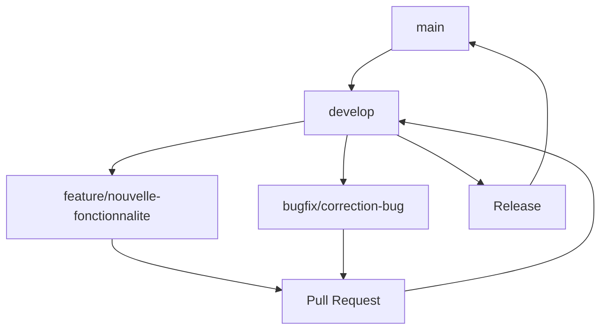

# 🎓 Tutoriel Complet - Devenir Contributeur ToDoList Collaborative

## 📚 Table des Matières

1. [Comprendre le Projet](#-comprendre-le-projet)
2. [Configuration de l'Environnement](#-configuration-de-lenvironnement)
3. [Comprendre les Branches Git](#-comprendre-les-branches-git)
4. [Workflow de Développement](#-workflow-de-développement)
5. [Première Contribution](#-première-contribution)
6. [Standards de Code](#-standards-de-code)
7. [Tests et Validation](#-tests-et-validation)
8. [Pull Request](#-pull-request)
9. [Résolution de Conflits](#-résolution-de-conflits)
10. [Ressources et Aide](#-ressources-et-aide)

---

## 🎯 Comprendre le Projet

### **Architecture du Projet**
```
todolist-collaborative/
├── backend/          # API Spring Boot (Java 11)
├── frontend/         # Interface Angular (TypeScript)
├── database/         # Scripts MySQL
├── docker/           # Configuration Docker
└── docs/             # Documentation
```

### **Technologies Utilisées**
- **Backend** : Spring Boot 2.7.18 + Java 11
- **Frontend** : Angular 16 + TypeScript
- **Base de données** : MySQL 8.0
- **Containerisation** : Docker + Docker Compose
- **CI/CD** : GitHub Actions

### **Objectif**
Créer une application collaborative de gestion de tâches où les équipes peuvent :
- Créer et gérer des projets
- Assigner des tâches aux membres
- Suivre l'avancement en temps réel
- Collaborer efficacement

---

## 🛠️ Configuration de l'Environnement

### **1. Prérequis**
```bash
# Vérifier les versions
java -version          # Java 11+
node -version          # Node.js 18+
docker --version       # Docker 20+
docker-compose --version
git --version
```

### **2. Fork et Clone**
```bash
# 1. Fork le projet sur GitHub (bouton "Fork")
# 2. Clonez VOTRE fork
git clone https://github.com/VOTRE_USERNAME/todolist-collaborative.git
cd todolist-collaborative

# 3. Ajoutez le repository original comme remote
git remote add upstream https://github.com/HrodMarRik/todolist-collaborative.git
```

### **3. Première Configuration**
```bash
# Vérifier les remotes
git remote -v
# Doit afficher :
# origin    https://github.com/VOTRE_USERNAME/todolist-collaborative.git (fetch)
# origin    https://github.com/VOTRE_USERNAME/todolist-collaborative.git (push)
# upstream  https://github.com/HrodMarRik/todolist-collaborative.git (fetch)
# upstream  https://github.com/HrodMarRik/todolist-collaborative.git (push)
```

### **4. Test de l'Environnement**
```bash
# Lancer le projet
docker-compose up -d

# Vérifier que tout fonctionne
curl http://localhost:8080/api/health
# Doit retourner : {"status":"UP","message":"ToDoList Collaborative API is running"}

# Accéder au frontend
# Ouvrir http://localhost:4200 dans le navigateur
```

---

## 🌿 Comprendre les Branches Git

### **Structure des Branches**



### **Types de Branches**

#### **🏠 Branches Principales**
- **`main`** : Code de production stable
  - ✅ Toujours fonctionnel
  - ✅ Déployé en production
  - ✅ Pas de commits directs

- **`develop`** : Code de développement intégré
  - 🔄 Branche principale de développement
  - 🔄 Intégration des nouvelles fonctionnalités
  - 🔄 Tests continus

#### **🌱 Branches de Développement**
- **`feature/nom-fonctionnalite`** : Nouvelles fonctionnalités
  - Exemple : `feature/authentification-jwt`
  - Exemple : `feature/gestion-projets`
  - Exemple : `feature/notifications-temps-reel`

- **`bugfix/description-bug`** : Corrections de bugs
  - Exemple : `bugfix/connexion-mysql`
  - Exemple : `bugfix/validation-formulaire`

- **`hotfix/urgence`** : Corrections urgentes en production
  - Exemple : `hotfix/securite-critique`

### **Convention de Nommage**
```bash
# Fonctionnalités
feature/authentification-jwt
feature/gestion-projets
feature/notifications-push

# Corrections
bugfix/connexion-database
bugfix/validation-email
bugfix/performance-lente

# Documentation
docs/api-documentation
docs/setup-guide

# Refactoring
refactor/cleanup-code
refactor/optimize-queries
```

---

## 🔄 Workflow de Développement

### **1. Synchronisation Avant de Commencer**
```bash
# Toujours commencer par synchroniser
git fetch upstream
git checkout develop
git merge upstream/develop
git push origin develop
```

### **2. Création d'une Branche de Fonctionnalité**
```bash
# Créer et basculer sur une nouvelle branche
git checkout -b feature/ma-nouvelle-fonctionnalite

# Vérifier que vous êtes sur la bonne branche
git branch
# Doit afficher : * feature/ma-nouvelle-fonctionnalite
```

### **3. Développement**
```bash
# Faire vos modifications
# Éditer les fichiers nécessaires

# Vérifier les changements
git status
git diff

# Ajouter les fichiers modifiés
git add .
# ou
git add fichier-specifique.java

# Commiter avec un message descriptif
git commit -m "feat: ajouter authentification JWT

- Ajouter configuration Spring Security
- Implémenter génération de tokens JWT
- Ajouter endpoint de login
- Tests unitaires pour AuthService"
```

### **4. Push et Pull Request**
```bash
# Pousser votre branche
git push origin feature/ma-nouvelle-fonctionnalite

# Créer une Pull Request sur GitHub
# Titre : feat: Ajouter authentification JWT
# Description : Détaillez vos changements
```

---

## 🎯 Première Contribution

### **Issues Recommandées pour Débuter**

#### **🏷️ Labels "Good First Issue"**
- Ajouter des tests unitaires
- Améliorer la documentation
- Corriger des typos
- Ajouter des validations simples

#### **📝 Exemple : Ajouter un Test Unitaire**
```bash
# 1. Synchroniser
git fetch upstream
git checkout develop
git merge upstream/develop

# 2. Créer une branche
git checkout -b feature/test-health-controller

# 3. Ajouter le test
# Créer : backend/src/test/java/com/todolist/controller/HealthControllerTest.java
```

```java
@SpringBootTest
@AutoConfigureTestDatabase
class HealthControllerTest {
    
    @Autowired
    private TestRestTemplate restTemplate;
    
    @Test
    void healthCheck_ShouldReturnOk() {
        ResponseEntity<Map> response = restTemplate.getForEntity("/api/health", Map.class);
        
        assertThat(response.getStatusCode()).isEqualTo(HttpStatus.OK);
        assertThat(response.getBody().get("status")).isEqualTo("UP");
    }
}
```

```bash
# 4. Tester
cd backend
mvn test

# 5. Commiter
git add .
git commit -m "test: ajouter test unitaire pour HealthController"
git push origin feature/test-health-controller
```

### **🎨 Exemple : Améliorer le Frontend**
```bash
# 1. Créer une branche
git checkout -b feature/ameliorer-interface

# 2. Modifier le composant
# Éditer : frontend/src/app/app.component.ts
```

```typescript
export class AppComponent {
  title = 'ToDoList Collaborative';
  
  constructor() {
    console.log('Application démarrée avec succès !');
  }
}
```

```bash
# 3. Tester le build
cd frontend
npm run build

# 4. Commiter
git add .
git commit -m "feat: améliorer l'interface utilisateur

- Ajouter message de démarrage
- Améliorer le titre de l'application"
git push origin feature/ameliorer-interface
```

---

## 📏 Standards de Code

### **Backend (Spring Boot)**

#### **Structure des Packages**
```
com.todolist/
├── controller/     # Contrôleurs REST
├── service/        # Logique métier
├── repository/     # Accès aux données
├── model/         # Entités JPA
├── dto/           # Data Transfer Objects
├── config/        # Configuration
└── exception/     # Gestion d'erreurs
```

#### **Conventions Java**
```java
// ✅ Bon
@RestController
@RequestMapping("/api/users")
public class UserController {
    
    private final UserService userService;
    
    public UserController(UserService userService) {
        this.userService = userService;
    }
    
    @GetMapping("/{id}")
    public ResponseEntity<UserDto> getUser(@PathVariable Long id) {
        UserDto user = userService.findById(id);
        return ResponseEntity.ok(user);
    }
}

// ❌ Mauvais
@RestController
public class usercontroller {
    @Autowired
    UserService userservice;
    
    @GetMapping("/user/{id}")
    public UserDto getuser(@PathVariable Long id) {
        return userservice.findbyid(id);
    }
}
```

#### **Messages de Commit**
```bash
# Format : type(scope): description

# Types possibles :
feat: nouvelle fonctionnalité
fix: correction de bug
docs: documentation
style: formatage
refactor: refactoring
test: ajout de tests
chore: tâches de maintenance

# Exemples :
feat(auth): ajouter authentification JWT
fix(database): corriger connexion MySQL
docs(api): documenter endpoints REST
test(controller): ajouter tests HealthController
```

### **Frontend (Angular)**

#### **Structure des Composants**
```
src/app/
├── components/     # Composants réutilisables
├── pages/         # Pages principales
├── services/      # Services Angular
├── models/        # Interfaces TypeScript
├── guards/        # Guards de navigation
└── shared/        # Éléments partagés
```

#### **Conventions TypeScript**
```typescript
// ✅ Bon
export interface User {
  id: number;
  name: string;
  email: string;
  createdAt: Date;
}

export class UserService {
  private readonly apiUrl = 'http://localhost:8080/api/users';
  
  constructor(private http: HttpClient) {}
  
  getUsers(): Observable<User[]> {
    return this.http.get<User[]>(this.apiUrl);
  }
}

// ❌ Mauvais
export interface user {
  id: number;
  name: string;
}

export class userservice {
  getusers() {
    return this.http.get('http://localhost:8080/api/users');
  }
}
```

---

## 🧪 Tests et Validation

### **Tests Backend**
```bash
# Lancer tous les tests
cd backend
mvn test

# Lancer un test spécifique
mvn test -Dtest=HealthControllerTest

# Tests avec couverture
mvn test jacoco:report
```

### **Tests Frontend**
```bash
# Tests unitaires
cd frontend
npm test

# Tests e2e (si configurés)
npm run e2e

# Build de production
npm run build
```

### **Tests Docker**
```bash
# Vérifier que tout fonctionne
docker-compose up -d
docker-compose ps

# Tester l'API
curl http://localhost:8080/api/health

# Tester le frontend
curl http://localhost:4200
```

### **Validation Avant Push**
```bash
# Checklist avant chaque commit
□ Code compilé sans erreurs
□ Tests passent
□ Code formaté correctement
□ Message de commit descriptif
□ Pas de fichiers temporaires
□ Documentation mise à jour si nécessaire
```

---

## 🔀 Pull Request

### **Création d'une PR**

#### **1. Sur GitHub**
1. Aller sur votre fork
2. Cliquer "Compare & pull request"
3. Sélectionner `develop` comme base
4. Remplir le template

#### **2. Template de PR**
```markdown
## 📝 Description
Brève description des changements apportés

## 🎯 Type de Changement
- [ ] 🐛 Bug fix
- [ ] ✨ Nouvelle fonctionnalité
- [ ] 💥 Breaking change
- [ ] 📚 Documentation
- [ ] 🎨 Style/formatage
- [ ] ♻️ Refactoring
- [ ] ⚡ Performance
- [ ] 🧪 Tests

## 🧪 Tests Effectués
- [ ] Tests unitaires ajoutés/mis à jour
- [ ] Tests d'intégration
- [ ] Tests manuels effectués
- [ ] Build Docker fonctionne
- [ ] Frontend se compile

## 📸 Captures d'Écran (si applicable)
Ajouter des captures d'écran pour les changements UI

## ✅ Checklist
- [ ] Code conforme aux standards
- [ ] Documentation mise à jour
- [ ] Pas de conflits avec develop
- [ ] Tests passent
- [ ] Code review effectué
```

### **Processus de Review**

#### **Pour le Contributeur**
1. **Attendre les commentaires** des reviewers
2. **Corriger** les points soulevés
3. **Pousser** les corrections
4. **Répondre** aux commentaires

#### **Pour le Reviewer**
1. **Tester** la branche localement
2. **Vérifier** le code
3. **Commenter** les améliorations
4. **Approuver** si satisfait

---

## ⚔️ Résolution de Conflits

### **Conflits de Merge**
```bash
# Si conflit lors du merge
git checkout develop
git merge upstream/develop

# Résoudre les conflits dans les fichiers
# Puis :
git add .
git commit -m "resolve: conflits de merge avec develop"
```

### **Conflits de Rebase**
```bash
# Si conflit lors du rebase
git rebase develop

# Résoudre les conflits
git add .
git rebase --continue

# Si problème, annuler
git rebase --abort
```

### **Stratégies de Résolution**
1. **Communiquer** avec l'équipe
2. **Comprendre** les changements
3. **Tester** après résolution
4. **Valider** que tout fonctionne

---

## 📚 Ressources et Aide

### **Documentation Officielle**
- [Spring Boot Documentation](https://spring.io/projects/spring-boot)
- [Angular Documentation](https://angular.io/docs)
- [Docker Documentation](https://docs.docker.com/)
- [Git Documentation](https://git-scm.com/doc)

### **Outils Recommandés**
- **IDE** : IntelliJ IDEA, VS Code
- **Git GUI** : GitKraken, SourceTree
- **API Testing** : Postman, Insomnia
- **Database** : MySQL Workbench, DBeaver

### **Communauté et Support**
- **Issues GitHub** : Pour les bugs et questions
- **Discussions** : Pour les questions générales
- **Slack/Discord** : Communication en temps réel
- **Code Review** : Apprentissage par l'exemple

### **Commandes Git Utiles**
```bash
# Voir l'historique
git log --oneline --graph

# Voir les différences
git diff HEAD~1

# Annuler le dernier commit
git reset --soft HEAD~1

# Voir les branches
git branch -a

# Nettoyer les branches locales
git branch -d nom-branche

# Synchroniser avec upstream
git fetch upstream
git checkout develop
git merge upstream/develop
```

### **En Cas de Problème**
1. **Consulter** la documentation
2. **Rechercher** dans les issues existantes
3. **Demander** de l'aide sur Discussions
4. **Créer** une issue si nécessaire

---

## 🎉 Félicitations !

Vous êtes maintenant prêt à contribuer au projet ToDoList Collaborative !

### **Prochaines Étapes**
1. **Choisir** une issue "Good First Issue"
2. **Créer** votre première branche
3. **Développer** votre fonctionnalité
4. **Créer** votre première Pull Request
5. **Apprendre** des reviews de code

### **Rappel Important**
- **Communiquez** avec l'équipe
- **Posez** des questions
- **Apprenez** des erreurs
- **Partagez** vos connaissances

---

**Bienvenue dans l'équipe ToDoList Collaborative ! 🚀**

*Ce tutoriel est vivant et s'améliore grâce à vos contributions.*
