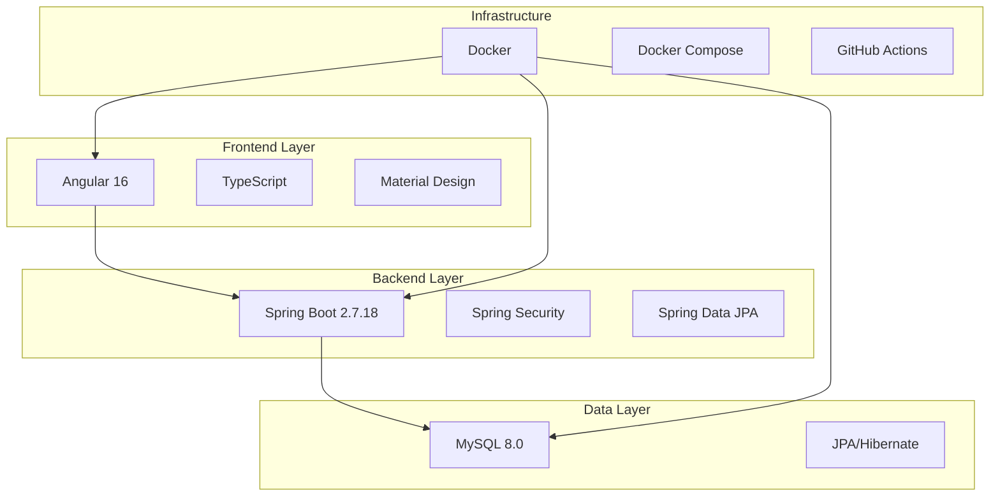
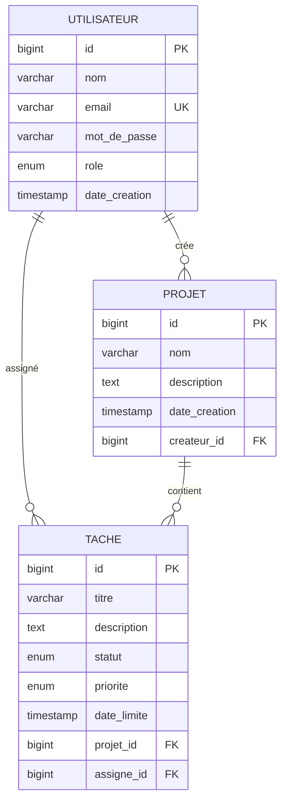

# 📋 ToDoList Collaborative

[](https://github.com/HrodMarRik/todolist-collaborative/actions)
[](https://www.docker.com/)
[](https://spring.io/projects/spring-boot)
[](https://angular.io/)
[](https://www.mysql.com/)

> **Application web collaborative de gestion de tâches** développée avec Spring Boot, Angular et MySQL, containerisée avec Docker.

## 🎯 Vue d'Ensemble

ToDoList Collaborative est une solution moderne qui permet aux équipes de **créer, organiser et suivre leurs tâches** de manière collaborative. L'application résout les problèmes de communication et de coordination que rencontrent 73% des équipes de projet.

### ✨ Fonctionnalités Principales

- 🏠 **Tableau de bord centralisé** - Vue d'ensemble des projets et tâches
- 👥 **Gestion collaborative** - Attribution et suivi des tâches en équipe
- 📊 **Vue Kanban** - Organisation visuelle des tâches par statut
- 🔐 **Authentification sécurisée** - JWT et gestion des rôles
- 📱 **Interface responsive** - Accessible sur tous les appareils
- 🔔 **Notifications temps réel** - Suivi des modifications

## 🚀 Démarrage Rapide

### 📋 Prérequis

- **Docker** 20.0+ et **Docker Compose** 2.0+
- **Git** pour cloner le repository
- **Navigateur web** moderne (Chrome, Firefox, Safari, Edge)

### ⚡ Installation

```bash
# 1. Cloner le repository
git clone https://github.com/HrodMarRik/todolist-collaborative.git
cd todolist-collaborative

# 2. Lancer l'application
docker-compose up -d

# 3. Vérifier que tout fonctionne
curl http://localhost:8080/api/health
```

### 🌐 Accès à l'Application

| Service | URL | Description |
|---------|-----|-------------|
| **Frontend** | http://localhost:4200 | Interface utilisateur Angular |
| **Backend API** | http://localhost:8080/api/health | API REST Spring Boot |
| **Base de données** | localhost:3306 | MySQL Database |

## 🛠️ Stack Technologique

### 🏗️ Architecture



### 🔧 Technologies Utilisées

| Composant | Technologie | Version | Rôle |
|-----------|-------------|---------|------|
| **Backend** | Spring Boot | 2.7.18 | API REST et logique métier |
| **Frontend** | Angular | 16.0.0 | Interface utilisateur |
| **Base de données** | MySQL | 8.0 | Stockage relationnel |
| **Authentification** | JWT | - | Tokens sécurisés |
| **Containerisation** | Docker | 20.0+ | Environnement isolé |
| **CI/CD** | GitHub Actions | - | Tests et déploiement |

## 📁 Structure du Projet

```
todolist-collaborative/
├── 📁 backend/                 # API Spring Boot
│   ├── src/main/java/com/todolist/
│   │   ├── controller/         # Contrôleurs REST
│   │   ├── service/            # Logique métier
│   │   ├── repository/         # Accès aux données
│   │   ├── model/              # Entités JPA
│   │   └── config/             # Configuration
│   └── pom.xml                 # Dépendances Maven
├── 📁 frontend/                # Application Angular
│   ├── src/app/
│   │   ├── components/         # Composants réutilisables
│   │   ├── services/           # Services Angular
│   │   └── models/             # Interfaces TypeScript
│   └── package.json            # Dépendances npm
├── 📁 database/                # Scripts MySQL
│   └── schema/
│       └── init.sql            # Initialisation DB
├── 📁 docker/                  # Configuration Docker
│   ├── backend/Dockerfile      # Image Spring Boot
│   ├── frontend/Dockerfile     # Image Angular
│   └── mysql/Dockerfile        # Image MySQL
├── 📁 docs/                    # Documentation
│   ├── PROJECT_PRESENTATION.md # Présentation du projet
│   ├── TECHNICAL_DECISIONS.md  # Décisions techniques
│   └── CONTRIBUTING.md         # Guide contributeurs
├── 📄 docker-compose.yml       # Orchestration services
├── 📄 .github/workflows/       # CI/CD Pipeline
└── 📄 README.md               # Ce fichier
```

## 🗄️ Modèle de Données

### Relations Principales



### Relations 1-to-Many Implémentées

- **Utilisateur → Projets** : Un utilisateur peut créer plusieurs projets
- **Projet → Tâches** : Un projet peut contenir plusieurs tâches  
- **Utilisateur → Tâches** : Un utilisateur peut avoir plusieurs tâches assignées

## 🚀 Développement

### 🔧 Configuration de l'Environnement

```bash
# Prérequis de développement
java -version          # Java 11+
node -version          # Node.js 18+
mvn -version           # Maven 3.6+
docker --version       # Docker 20.0+
```

### 🏃‍♂️ Démarrage en Mode Développement

#### Backend (Spring Boot)
```bash
cd backend
mvn spring-boot:run
# API disponible sur http://localhost:8080
```

#### Frontend (Angular)
```bash
cd frontend
npm install
npm start
# Interface disponible sur http://localhost:4200
```

#### Base de Données (MySQL)
```bash
# Avec Docker
docker run -d \
  --name todolist-mysql \
  -e MYSQL_ROOT_PASSWORD=root_password \
  -e MYSQL_DATABASE=todolist_db \
  -e MYSQL_USER=todolist_user \
  -e MYSQL_PASSWORD=todolist_password \
  -p 3306:3306 \
  mysql:8.0
```

### 🧪 Tests

```bash
# Tests Backend
cd backend
mvn test

# Tests Frontend  
cd frontend
npm test

# Tests Docker
docker-compose up -d
docker-compose ps
```

## 📚 Documentation

### 📖 Guides Disponibles

| Document | Description | Public Cible |
|----------|-------------|--------------|
| **[Présentation du Projet](docs/PROJECT_PRESENTATION.md)** | Contexte, objectifs et architecture | Stakeholders, équipe |
| **[Décisions Techniques](docs/TECHNICAL_DECISIONS.md)** | Justification des choix technologiques | Développeurs |
| **[Guide Contributeurs](CONTRIBUTING.md)** | Tutoriel complet pour nouveaux contributeurs | Contributeurs |

### 🔗 Ressources Externes

- [Spring Boot Documentation](https://spring.io/projects/spring-boot)
- [Angular Documentation](https://angular.io/docs)
- [MySQL Documentation](https://dev.mysql.com/doc/)
- [Docker Documentation](https://docs.docker.com/)

## 🤝 Contribution

Nous accueillons les contributions ! Consultez notre **[Guide de Contribution](CONTRIBUTING.md)** pour :

- 🎯 **Première contribution** - Issues recommandées pour débuter
- 🌿 **Workflow Git** - Branches, commits, pull requests
- 📏 **Standards de code** - Conventions Java et TypeScript
- 🧪 **Tests et validation** - Processus de qualité
- ⚔️ **Résolution de conflits** - Gestion des problèmes

### 🚀 Démarrage Rapide pour Contributeurs

```bash
# 1. Fork et clone
git clone https://github.com/VOTRE_USERNAME/todolist-collaborative.git
cd todolist-collaborative

# 2. Synchroniser avec upstream
git remote add upstream https://github.com/HrodMarRik/todolist-collaborative.git
git fetch upstream
git checkout develop
git merge upstream/develop

# 3. Créer une branche de fonctionnalité
git checkout -b feature/ma-nouvelle-fonctionnalite

# 4. Développer et tester
docker-compose up -d
# Faire vos modifications...

# 5. Commiter et pousser
git add .
git commit -m "feat: ajouter nouvelle fonctionnalité"
git push origin feature/ma-nouvelle-fonctionnalite

# 6. Créer une Pull Request sur GitHub
```

## 🔄 CI/CD Pipeline

Notre pipeline GitHub Actions valide automatiquement :

- ✅ **Tests Backend** - Spring Boot avec MySQL
- ✅ **Build Frontend** - Angular et TypeScript  
- ✅ **Build Docker** - Images des 3 services
- ✅ **Qualité du code** - Standards et conventions

### 📊 Statut du Pipeline

[](https://github.com/HrodMarRik/todolist-collaborative/actions)

## 🐳 Déploiement

### 🏠 Déploiement Local

```bash
# Démarrage complet
docker-compose up -d

# Vérification des services
docker-compose ps

# Logs des services
docker-compose logs -f backend
docker-compose logs -f frontend
docker-compose logs -f mysql
```

### ☁️ Déploiement Production

```bash
# Build des images
docker-compose build

# Démarrage en production
docker-compose -f docker-compose.prod.yml up -d
```

## 📈 Roadmap

### 🎯 Fonctionnalités Actuelles
- [x] Authentification JWT
- [x] Gestion des utilisateurs
- [x] CRUD des projets et tâches
- [x] Interface responsive
- [x] API REST complète

### 🚀 Fonctionnalités Futures
- [ ] Notifications temps réel (WebSocket)
- [ ] Application mobile (React Native)
- [ ] Intégrations tierces (Slack, Teams)
- [ ] Analytics et rapports
- [ ] IA pour suggestions de tâches

## 🐛 Support et Aide

### 📞 Obtenir de l'Aide

- **🐛 Bug Report** : [Créer une issue](https://github.com/HrodMarRik/todolist-collaborative/issues)
- **💡 Feature Request** : [Proposer une fonctionnalité](https://github.com/HrodMarRik/todolist-collaborative/issues)
- **💬 Discussions** : [Forum communautaire](https://github.com/HrodMarRik/todolist-collaborative/discussions)
- **📧 Contact** : [Email de l'équipe](mailto:contact@todolist-collaborative.com)

### 🔍 Dépannage

#### Problèmes Courants

| Problème | Solution |
|----------|----------|
| **Port déjà utilisé** | `docker-compose down` puis `docker-compose up -d` |
| **Base de données inaccessible** | Vérifier les variables d'environnement MySQL |
| **Frontend ne se charge pas** | Vérifier que le backend est démarré |
| **Erreurs de build** | `docker-compose build --no-cache` |

## 📄 Licence

Ce projet est sous licence **MIT**. Voir le fichier [LICENSE](LICENSE) pour plus de détails.

## 👥 Équipe

| Rôle | Responsabilité |
|------|----------------|
| **Product Owner** | Vision produit et priorités |
| **Backend Developer** | API REST et base de données |
| **Frontend Developer** | Interface utilisateur |
| **DevOps Engineer** | Infrastructure et CI/CD |
| **QA Tester** | Tests et qualité |

## 🙏 Remerciements

- **Spring Boot** - Framework backend robuste
- **Angular** - Framework frontend moderne  
- **MySQL** - Base de données relationnelle fiable
- **Docker** - Containerisation simplifiée
- **GitHub** - Plateforme de collaboration

---

<div align="center">

**🚀 Prêt à transformer la collaboration d'équipe ?**

[](https://github.com/HrodMarRik/todolist-collaborative#-démarrage-rapide)
[](https://github.com/HrodMarRik/todolist-collaborative#-documentation)
[](https://github.com/HrodMarRik/todolist-collaborative#-contribution)

</div>
