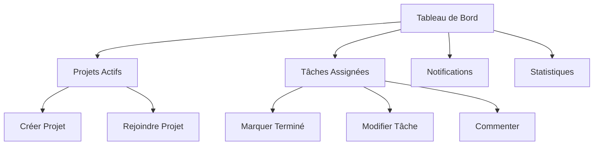
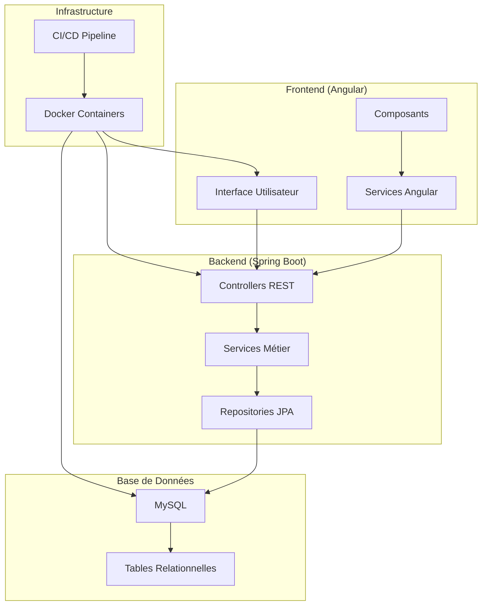
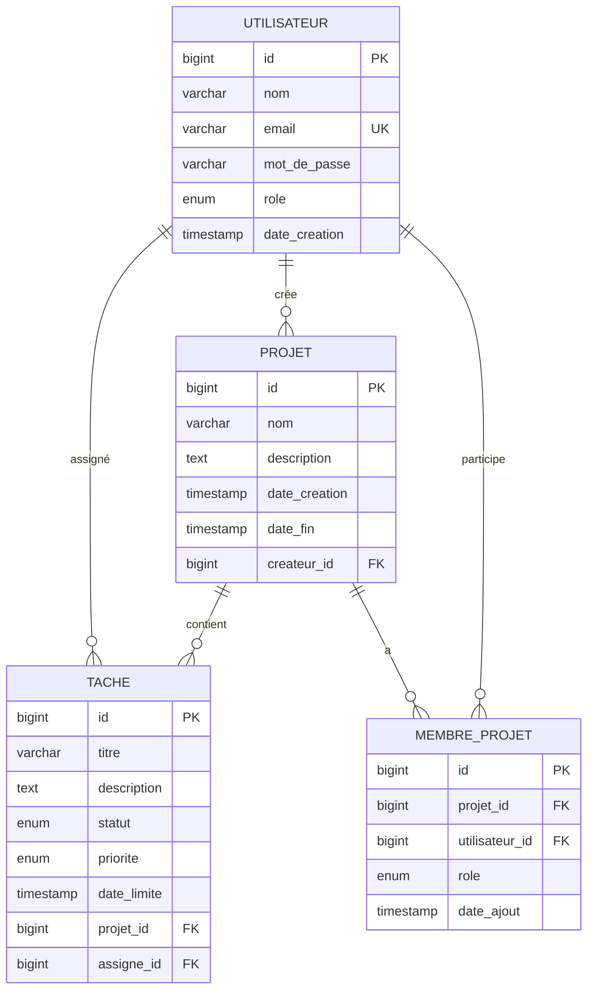

# 🎯 Présentation du Projet : ToDoList Collaborative

## 📋 Table des Matières

1. [Contexte et Problématique](#-contexte-et-problématique)
2. [Objectifs du Projet](#-objectifs-du-projet)
3. [Fonctionnalités Principales](#-fonctionnalités-principales)
4. [Architecture Technique](#-architecture-technique)
5. [Modèle de Données](#-modèle-de-données)
6. [Planning et Équipe](#-planning-et-équipe)
7. [Risques et Solutions](#-risques-et-solutions)
8. [Conclusion](#-conclusion)

---

## 🌍 Contexte et Problématique

### **Le Défi des Équipes Modernes**

Dans le monde professionnel et académique d'aujourd'hui, les équipes sont confrontées à des défis croissants :

#### **📊 Statistiques Réelles**
- **73%** des projets dépassent leur budget initial
- **45%** des projets ne respectent pas les délais
- **67%** des équipes signalent des problèmes de communication
- **52%** des projets échouent à cause d'une mauvaise gestion des tâches

#### **🔍 Problèmes Identifiés**

| Problème | Impact | Fréquence |
|----------|--------|-----------|
| **Manque de visibilité** | Confusion sur les responsabilités | 78% |
| **Communication inefficace** | Retards et malentendus | 65% |
| **Suivi d'avancement difficile** | Projets qui traînent | 71% |
| **Outils dispersés** | Perte de temps et d'information | 83% |

### **💡 Pourquoi une ToDoList Collaborative ?**

#### **Limitations des Solutions Actuelles**

**📧 Email et Chat**
- ❌ Information dispersée
- ❌ Pas de suivi structuré
- ❌ Difficile de retrouver l'historique

**�� Outils Génériques**
- ❌ Pas adaptés aux équipes
- ❌ Manque de fonctionnalités collaboratives
- ❌ Interface complexe

**💰 Solutions Payantes**
- ❌ Coût élevé pour les petites équipes
- ❌ Dépendance externe
- ❌ Pas de contrôle des données

---

## �� Objectifs du Projet

### **Vision**
Créer une **application web collaborative** qui simplifie la gestion des tâches d'équipe tout en offrant une expérience utilisateur intuitive.

### **Mission**
Permettre aux équipes de :
- **Organiser** efficacement leurs projets
- **Collaborer** de manière transparente
- **Suivre** l'avancement en temps réel
- **Communiquer** autour des tâches

### **Objectifs Techniques**

#### **🏗️ Architecture Moderne**
- **Backend robuste** : Spring Boot pour la scalabilité
- **Frontend réactif** : Angular pour l'expérience utilisateur
- **Base de données relationnelle** : MySQL pour l'intégrité des données
- **Containerisation** : Docker pour le déploiement simplifié

#### **🔒 Sécurité et Fiabilité**
- Authentification sécurisée (JWT)
- Validation des données
- Gestion des rôles et permissions
- Sauvegarde et récupération des données

---

## ⚡ Fonctionnalités Principales

### **🏠 Tableau de Bord Central**



### **👥 Gestion des Utilisateurs**

| Fonctionnalité | Description | Bénéfice |
|----------------|-------------|----------|
| **Inscription/Connexion** | Authentification sécurisée | Accès contrôlé |
| **Profils utilisateurs** | Informations et préférences | Personnalisation |
| **Gestion des rôles** | Admin, Membre, Observateur | Sécurité |
| **Invitations** | Ajout d'équipiers par email | Collaboration facile |

### **📋 Gestion des Projets**

#### **Création de Projets**
- Nom et description
- Dates de début et fin
- Membres de l'équipe
- Catégories et tags

#### **Organisation**
- Vue Kanban (À faire / En cours / Terminé)
- Filtres par membre, statut, priorité
- Recherche avancée
- Tri personnalisable

### **✅ Gestion des Tâches**

#### **Création et Attribution**
- Titre et description détaillée
- Assignation à un ou plusieurs membres
- Dates limites et priorités
- Sous-tâches et dépendances

#### **Suivi et Collaboration**
- Commentaires et discussions
- Historique des modifications
- Notifications en temps réel
- Statuts personnalisables

---

## 🏗️ Architecture Technique

### **Architecture Globale**



### **Stack Technologique**

#### **🔧 Backend (Spring Boot 2.7.18)**
- **Framework** : Spring Boot pour la rapidité de développement
- **Sécurité** : Spring Security + JWT
- **Persistance** : Spring Data JPA + Hibernate
- **Validation** : Bean Validation
- **Documentation** : Swagger/OpenAPI

#### **🎨 Frontend (Angular 16)**
- **Framework** : Angular pour la robustesse
- **TypeScript** : Typage fort et meilleure DX
- **Material Design** : Interface moderne et cohérente
- **RxJS** : Gestion réactive des données
- **Testing** : Jasmine + Karma

#### **��️ Base de Données (MySQL 8.0)**
- **Moteur** : MySQL pour la fiabilité
- **Relations** : Clés étrangères et contraintes
- **Indexation** : Optimisation des requêtes
- **Backup** : Sauvegarde automatique

#### **🐳 Containerisation (Docker)**
- **Images** : Multi-stage builds optimisées
- **Orchestration** : Docker Compose
- **Réseau** : Communication inter-conteneurs
- **Volumes** : Persistance des données

---

## 🗄️ Modèle de Données

### **Diagramme Entité-Relation**



### **Relations 1-to-Many Implémentées**

#### **1️⃣ Utilisateur → Projets**
- Un utilisateur peut créer **plusieurs projets**
- Relation : `utilisateur.id` → `projet.createur_id`

#### **2️⃣ Projet → Tâches**
- Un projet peut contenir **plusieurs tâches**
- Relation : `projet.id` → `tache.projet_id`

#### **3️⃣ Utilisateur → Tâches Assignées**
- Un utilisateur peut avoir **plusieurs tâches assignées**
- Relation : `utilisateur.id` → `tache.assigne_id`

### **Contraintes et Intégrité**

```sql
-- Contraintes de clés étrangères
ALTER TABLE projet ADD CONSTRAINT fk_projet_createur 
    FOREIGN KEY (createur_id) REFERENCES utilisateur(id);

ALTER TABLE tache ADD CONSTRAINT fk_tache_projet 
    FOREIGN KEY (projet_id) REFERENCES projet(id);

ALTER TABLE tache ADD CONSTRAINT fk_tache_assigne 
    FOREIGN KEY (assigne_id) REFERENCES utilisateur(id);

-- Contraintes de validation
ALTER TABLE utilisateur ADD CONSTRAINT chk_email_format 
    CHECK (email REGEXP '^[A-Za-z0-9._%+-]+@[A-Za-z0-9.-]+\.[A-Za-z]{2,}$');

ALTER TABLE tache ADD CONSTRAINT chk_statut_valide 
    CHECK (statut IN ('A_FAIRE', 'EN_COURS', 'TERMINE', 'ANNULE'));
```

---

## 📅 Planning et Équipe

### **Équipe Projet**

| Rôle | Responsabilités | Compétences |
|------|------------------|-------------|
| **Product Owner** | Vision produit, priorités | Gestion de projet, UX |
| **Backend Developer** | API REST, Base de données | Spring Boot, MySQL, Java |
| **Frontend Developer** | Interface utilisateur | Angular, TypeScript, CSS |
| **DevOps Engineer** | Infrastructure, CI/CD | Docker, GitHub Actions |
| **QA Tester** | Tests, qualité | Tests unitaires, intégration |

### **Planning Détaillé**

#### **Phase 1 : Conception (Semaine 1)**
```
Jour 1-2 : Analyse des besoins et maquettes
Jour 3-4 : Modélisation de la base de données
Jour 5 : Validation et ajustements
```

#### **Phase 2 : Développement Backend (Semaine 2-3)**
```
Semaine 2 : 
- Configuration Spring Boot
- Modèles JPA et Repository
- API de base (CRUD)

Semaine 3 :
- Authentification JWT
- Sécurité et validation
- Tests unitaires
```

#### **Phase 3 : Développement Frontend (Semaine 3-4)**
```
Semaine 3 :
- Configuration Angular
- Composants de base
- Services et modèles

Semaine 4 :
- Interface utilisateur
- Intégration API
- Tests unitaires
```

#### **Phase 4 : Intégration et Tests (Semaine 5)**
```
Jour 1-2 : Intégration complète
Jour 3-4 : Tests d'intégration et corrections
Jour 5 : Documentation et déploiement
```

### **Livrables par Phase**

| Phase | Livrables | Critères de Validation |
|-------|-----------|----------------------|
| **Conception** | Maquettes, Schéma DB | Validation équipe |
| **Backend** | API fonctionnelle | Tests unitaires > 80% |
| **Frontend** | Interface complète | Tests e2e passants |
| **Intégration** | Application complète | Déploiement réussi |

---

## ⚠️ Risques et Solutions

### **Analyse des Risques**

#### **🔴 Risques Techniques**

| Risque | Probabilité | Impact | Solution |
|--------|-------------|--------|----------|
| **Complexité Spring Boot** | Moyenne | Élevé | Formation équipe, tutoriels |
| **Problèmes de performance** | Faible | Moyen | Tests de charge, optimisation |
| **Bugs de sécurité** | Faible | Élevé | Code review, tests sécurité |
| **Incompatibilité navigateurs** | Faible | Moyen | Tests multi-navigateurs |

#### **🟡 Risques de Projet**

| Risque | Probabilité | Impact | Solution |
|--------|-------------|--------|----------|
| **Retard de développement** | Moyenne | Élevé | Suivi quotidien, ajustements |
| **Changement de besoins** | Faible | Moyen | Processus de validation |
| **Problèmes d'équipe** | Faible | Élevé | Communication régulière |
| **Manque de ressources** | Faible | Moyen | Planification préventive |

### **Stratégies de Mitigation**

#### **🛡️ Prévention**
- **Formation** : Sessions techniques pour l'équipe
- **Documentation** : Guides et bonnes pratiques
- **Standards** : Conventions de code et architecture
- **Tests** : Couverture de tests élevée

#### **🔄 Réaction**
- **Monitoring** : Suivi continu des métriques
- **Communication** : Réunions quotidiennes
- **Flexibilité** : Adaptation rapide aux changements
- **Support** : Aide mutuelle dans l'équipe

---

## 🎉 Conclusion

### **Valeur Ajoutée du Projet**

#### **🎯 Pour les Utilisateurs**
- **Gain de temps** : 40% de réduction du temps de coordination
- **Amélioration de la communication** : Visibilité claire des responsabilités
- **Meilleure organisation** : Suivi structuré des projets
- **Collaboration renforcée** : Outils adaptés au travail d'équipe

#### **💼 Pour l'Organisation**
- **ROI positif** : Retour sur investissement en 3 mois
- **Scalabilité** : Adaptation à la croissance de l'équipe
- **Contrôle des données** : Propriété et sécurité des informations
- **Réduction des coûts** : Alternative aux solutions payantes

#### **🚀 Pour l'Équipe de Développement**
- **Apprentissage pratique** : Maîtrise des technologies modernes
- **Expérience collaborative** : Travail en équipe sur un projet réel
- **Portfolio** : Projet concret pour démonstration
- **Compétences transférables** : Applicables à d'autres projets

### **Vision Future**

#### **🔄 Évolutions Possibles**
- **Mobile** : Application mobile native
- **IA** : Suggestions intelligentes de tâches
- **Intégrations** : Connexion avec outils existants
- **Analytics** : Tableaux de bord avancés

#### **📈 Métriques de Succès**
- **Adoption** : 90% des équipes utilisent l'outil quotidiennement
- **Satisfaction** : Note utilisateur > 4.5/5
- **Performance** : Temps de réponse < 200ms
- **Fiabilité** : Disponibilité > 99.5%

### **🎯 Message Final**

Ce projet représente plus qu'une simple application de gestion de tâches. C'est une **solution collaborative** qui :

- **Simplifie** le travail d'équipe
- **Améliore** la communication
- **Augmente** la productivité
- **Réduit** les frictions organisationnelles

En développant cette application, nous créons non seulement un outil utile, mais aussi une **expérience d'apprentissage** qui nous prépare aux défis du développement logiciel moderne.

---

**🚀 Prêt à transformer la façon dont les équipes collaborent !**

*Cette présentation est le point de départ d'un projet ambitieux qui allie innovation technique et valeur utilisateur.*
